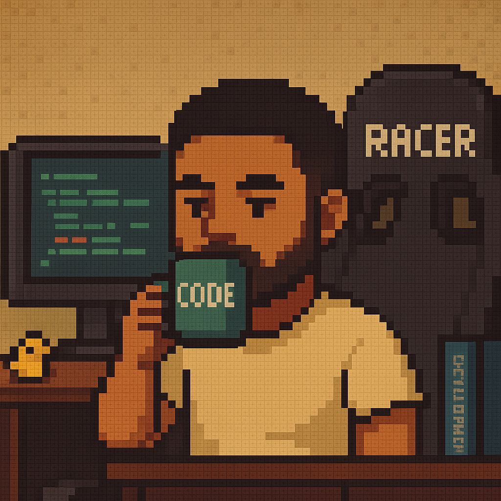

 <h1> 
  👉  Hey there, Welcome to my profile! 
 </h1> 

<table>
<tr>
 <td>
 👨🏽‍💻 <strong>Computer Engineering</strong> student at <a href="https://www.cefetmg.br/home/">CEFET-MG</a>. 
 ⚙️ Passionate about <strong>Automation (RPA)</strong>, <strong>Fullstack Development</strong>, and <strong>LLMs</strong>. 
 🚀 Experienced with <strong>Python</strong>, <strong>Django</strong>, <strong>FastAPI</strong>, <strong>Docker</strong>, and <strong>.NET (C#)</strong>. 
 🕹️ Browser automation using <strong>Selenium</strong>, <strong>Playwright</strong>, <strong>Puppeteer</strong> 
 🧠 I build tools and solutions with <strong>Node.js</strong>, <strong>TypeScript</strong>, <strong>Electron</strong>, <strong>Vue</strong>, and <strong>TailwindCSS</strong> and <strong>n8n</strong> 
 🗓️ Actively studying <strong>Generative AI</strong> and <strong>LLMs (with LangChain)</strong>, integrating them into real-world systems. 
 </td>
 <td>
  
 </td>
</tr>
</table>

---

### 🛠️ Main Technologies & Tools

<!-- Backend -->

<!-- Automation -->

<!-- Frontend / Desktop -->

<!-- Extras -->

